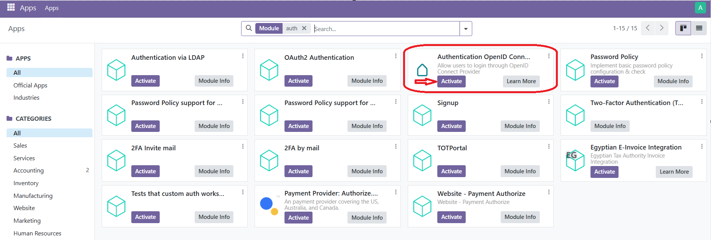
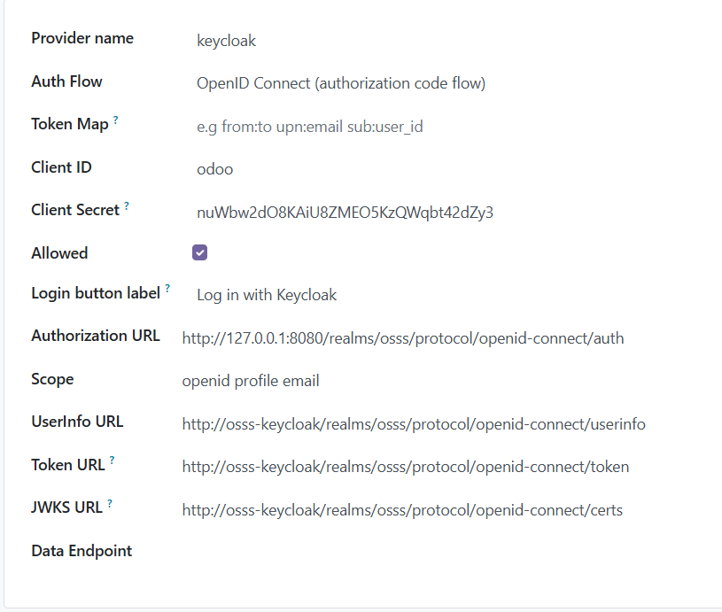
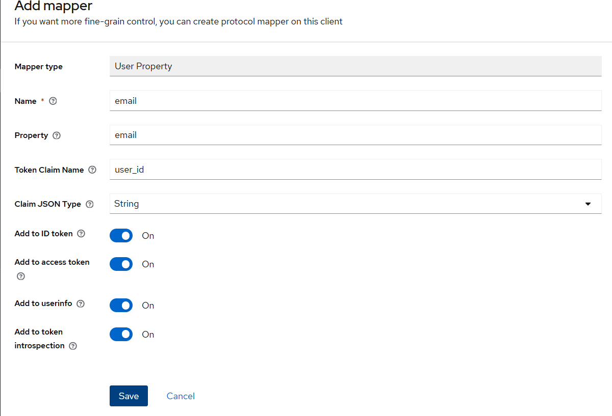

# Integración de SSO a Odoo mediante Keycloak
Aquí detallo como lograr el SSO a Odoo agregando un módulo externo y configurandoló manualmente.

## Current behaviour
Odoo funciona únicamente con login local

## Desired behaviour
Loguearse a odoo mediante Keycloak y lograr la configuración de forma programática

## What's done
Se logró hacer funcionar el SSO de odoo mediante configuración manual

## To do
- Automatizar las configuraciones para que sean aplicadas en el momento de instalar el chart
- Investigar acerca de cómo funcionan los roles de odoo. Creo que depende más del lado de odoo.

# Pasos
Odoo ofrece sus modulos en forma de addons. La comunidad ofrece multitud de estos. En su instalación base trae varios modulos listos para instalar. Dentro de estos, se encuentra uno que permite el protocolo de autenticación OAuth, sin embargo, no pude hacerlo funcionar. En cambio, tuve que instalar uno externo de la comunidad para hacerlo mediante el protocolo OpenID Connect. Aquí muestro el proceso.

- Descomprimir zip del addon de odoo [auth_oidc](https://odoo-community.org/shop/authentication-openid-connect-6545#attr=940049)

- Copiar la carpeta auth_oidc dentro del directorio de addons del pod: 

kubectl cp auth_oidc default/osss-odoo-7588c6fbfc-cbshp:/bitnami/odoo/addons

- Este módulo depende de python-jose, para instalarlo, activar venv dentro del container primero: 

root@osss-odoo-7588c6fbfc-vt9st:/opt/bitnami/odoo# source venv/bin/activate

(venv) root@osss-odoo-7588c6fbfc-vt9st:/opt/bitnami/odoo# pip3 install python-jose

- Instalar el módulo de OpenID Connect en odoo

- Configurar keycloak en odoo. Para esto, vamos a settings -> Integrations -> OAuth Authentication -> OAuth Providers -> New

- En keycloak, configurar un role mapper en el cliente odoo (hecho en _keycloak.yml)
